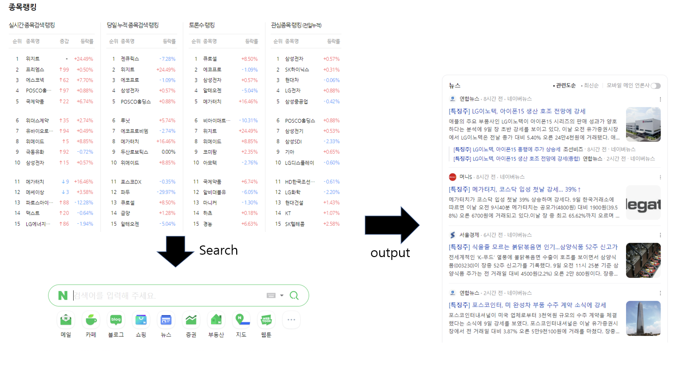
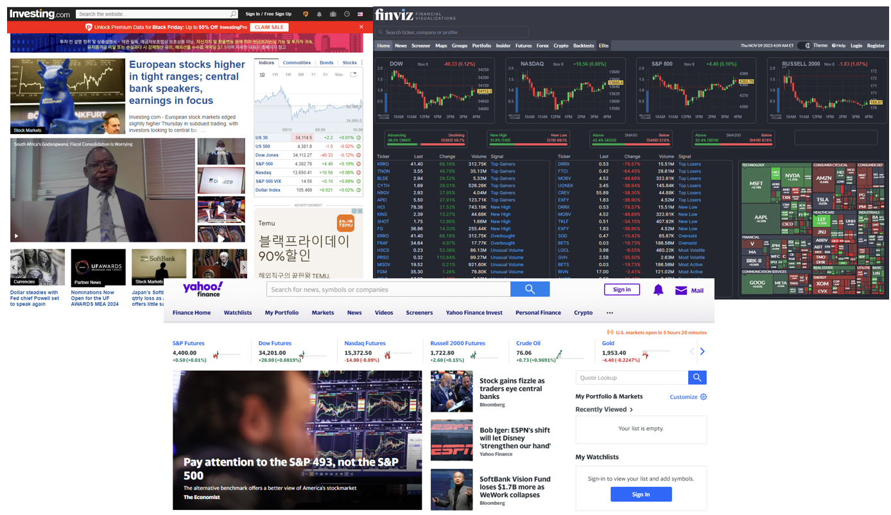

# Finance Trading Assitance

## Abstract
#### 주요기능
1. 주식 시장 참여자들에게 관심을 받는 종목들이 왜 관심을 받는지 뉴스 찾아주기<br>
    <br>
2. 당일 시황에 대해 알기 쉽게 한 눈에 들어오도록 information들을 wrap up하여 제공 <br>
    시황 관련 사이트들은 광고가 많은 편인데, 의미 있는 정보들만 추려서 제공
    
3. 크롤링한 정보들을 한눈에 볼 수 있게 웹사이트나 excel 파일 등에 한번에 출력하여 제공


## Team Roles
- 연선우<br>
    Python, JavaScript 등을 이용해 목표한 사이트들에서 정보를 긁어오는 기능 구현
- 문원주<br>
    HTML을 및 JavaScript를 이용해 전반적인 웹페이지 구축 및 기능 구현
- 전기헌<br>
    HTML을 및 JavaScript를 이용해 전반적인 웹페이지 구축 및 기능 구현
- 방채경<br>
    CSS를 이용해 웹페이지 디자인

## Project Schedule
```
1주차(11/03 ~ 11/09) 주제 선정, 기능 구현 및 정보를 가져올 website 결정, 역할 분배
2주차(11/10 ~ 11/16) 다양한 website로부터 정보를 긁어오는 기능 구현 시작
3주차(11/17 ~ 11/23) web crawling 진행, 웹페이지 outlook 제작 시작
4주차(11/24 ~ 11/30) web crawling으로 얻은 정보들 후처리 하여 전달, 웹페이지 디자인 시작
5주차(12/01 ~ 12/07) information web page에 출력 후 가독성 향상작업
```

## Technologies
- HTML
- CSS (협업 용이성을 위해 tailwind 고려 중)
- Javascript
- Python
